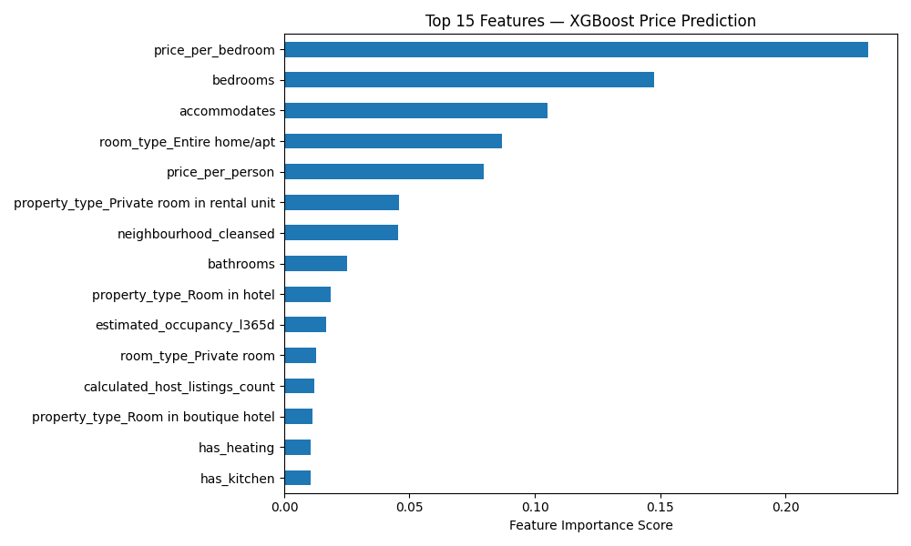
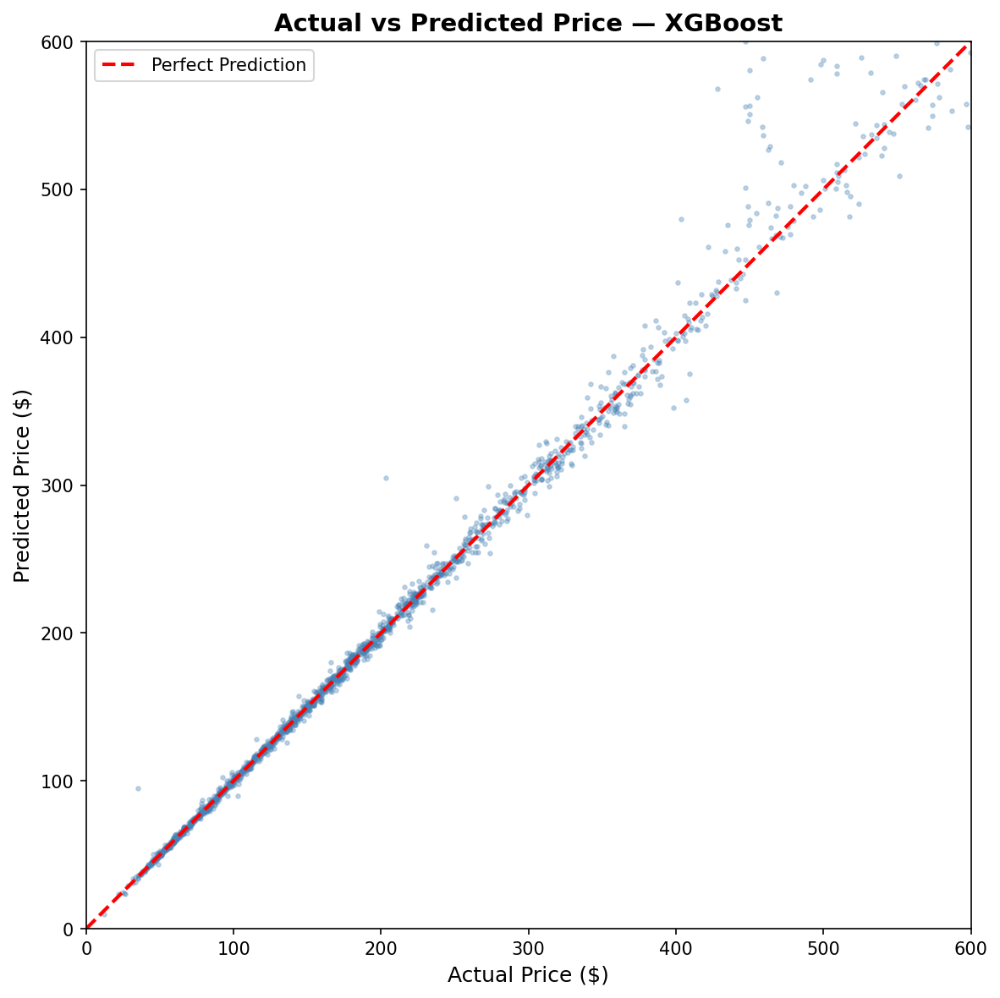

<div align="center">

# 🏙️ NYC Airbnb Price Prediction Pipeline

**End-to-end data engineering pipeline on 12M+ rows of NYC Airbnb data**  
*From raw messy CSVs → production-ready ML model in 7 notebooks*

[](https://python.org)
[](https://xgboost.readthedocs.io)
[](https://scikit-learn.org)

</div>

---

## 🎯 What This Project Does

Takes three raw, messy Airbnb CSV files and builds a complete ML pipeline to predict nightly listing prices across New York City — cleaning 90 raw columns down to 43 engineered features, training three models, and achieving **99.1% R² with $114 average prediction error**.

---

## 📊 Results

| Model | Val R² | Test R² | Avg Dollar Error |
|-------|--------|---------|-----------------|
| Ridge Baseline | 0.913 | — | $1,014 |
| Random Forest | 0.988 | — | $148 |
| **XGBoost ✓** | **0.988** | **0.991** | **$114** |

> Trained on 16,416 listings · Validated on 2,052 · Tested on 2,053  
> Stratified 80/10/10 split by NYC borough

---

## 🗺️ Feature Importance

The top features driving price predictions — two of the top five were **engineered** during this pipeline:



Key findings:
- `price_per_bedroom` — strongest signal by far (engineered feature)
- `bedrooms` + `accommodates` — size drives price
- `room_type_Entire home/apt` — entire homes command significant premium
- `neighbourhood_cleansed` — location matters (target encoded)

---

## 📈 Model Performance



---

## 🗂️ Project Structure

```
airbnb-data-pipeline/
│
├── 📓 notebooks/
│   ├── 01_cleaning_listing_data.ipynb       # clean 90-column listings file
│   ├── 02_cleaning_reviews_data.ipynb       # aggregate 700k review rows
│   ├── 03_cleaning_calendar_data.ipynb      # aggregate 12M calendar rows
│   ├── 04_feature_engineering.ipynb     # merge, engineer features, outlier capping
│   ├── 05_ml_pipeline.ipynb             # train/val/test split
│   └── 06_ml_encoding.ipynb             # encoding, scaling, train 3 models
│   └── 0_plots.ipynb             # plotting of all the data
│
├── 📊 plots/
│   ├── 01_price_distribution.png        # before/after log transform
│   ├── 02_price_by_borough.png          # price distribution by NYC borough
│   ├── 03_price_by_room_type.png        # entire home vs private room
│   ├── 04_price_map.png                 # geographic price heatmap
│   ├── 05_correlation_heatmap.png       # feature correlations
│   ├── 06_actual_vs_predicted.png       # model performance plot
│   └── feature_importance.png           # XGBoost top 15 features
│
├── 🤖 models/
│   └── xgboost_airbnb_model.pkl         # trained XGBoost model (2MB)
│
├── 🔧 src/
│   └── utils.py                         # reusable functions (cap_outliers, etc.)
│
├── 📁 data/
│   ├── raw/                             # original CSVs (not in repo — see below)
│   ├── processed/                       # cleaned intermediate files
│   └── output/                          # final train/val/test splits
│
├── .gitignore
├── requirements.txt
└── README.md
```

---

## 🔍 Pipeline Overview

```
Raw Data                    Cleaning                  Features
─────────                   ────────                  ────────
listings.csv.gz   ──►  drop 47 useless cols  ──►  price_per_bedroom
reviews.csv.gz    ──►  parse $1,200 → 1200   ──►  price_per_person
calendar.csv.gz   ──►  fill nulls smartly    ──►  host_experience_level
                         fix t/f booleans         availability_score
35,036 listings   ──►  parse amenity JSON    ──►  amenity binary flags
90 raw columns         IQR outlier capping        review_score_avg
                                                        │
                                                        ▼
                                              20,521 clean rows
                                              43 engineered features
                                                        │
                                              ┌─────────┼─────────┐
                                           Train      Val       Test
                                          16,416     2,052     2,053
                                                        │
                                              XGBoost Regressor
                                                        │
                                              R² = 0.991
                                           $114 avg error
```

---

## 🛠️ Key Challenges Solved

**1. 12M row calendar file**  
Aggregated per listing using `groupby().agg()` to extract `availability_rate` and `total_days` — reducing 12M rows to one row per listing.

**2. Amenities stored as JSON-like strings**  
`'["Wifi", "Kitchen", "TV"]'` parsed with `json.loads()` + loop to create 12 binary feature columns for key amenities.

**3. neighbourhood_cleansed had 200+ unique values**  
One-hot encoding would create 200+ columns. Used **target encoding** — replaced each neighbourhood with its mean `log_price` computed from the train set only.

**4. Train/val/test leakage prevention**  
All encoders and scalers fit exclusively on X_train, then applied to X_val and X_test — no information leakage.

---

## 📦 Data

This project uses the [Inside Airbnb](http://insideairbnb.com/get-the-data/) dataset for **New York City**.

To reproduce locally:

1. Go to http://insideairbnb.com/get-the-data/
2. Scroll to **New York City** (april 2026)
3. Download:
   - `listings.csv.gz` — Detailed listings data (~50MB)
   - `reviews.csv.gz` — Detailed review data
   - `calendar.csv.gz` — Daily availability data (~300MB)
4. Place all three in `data/raw/`

> Raw data files are not included in this repo due to file size.

---

## 🚀 How to Run

```bash
# 1. clone the repo
git clone https://github.com/master-zero1/airbnb-data-pipeline.git
cd airbnb-data-pipeline

# 2. install dependencies
pip install -r requirements.txt

# 3. download data (see above) and place in data/raw/

# 4. run notebooks in order
# 01 → 02 → 03 → 04 → 05 
# then run 06 in Google Colab for model 
# and then 07 for plots
```

---

## 🔮 Use the Trained Model

Load and use the saved XGBoost model directly:

```python
import joblib
import numpy as np

model = joblib.load('models/xgboost_airbnb_model.pkl')

# predict price (remember: model outputs log_price)
prediction = model.predict(X_test)
price_dollars = np.expm1(prediction)
print(f"Predicted price: ${price_dollars[0]:.2f}")
```

---

## 📚 Tech Stack

| Tool | Purpose |
|------|---------|
| Pandas | Data loading, cleaning, transformation |
| NumPy | Numerical operations, log transforms |
| Scikit-learn | Encoding, scaling, Ridge, Random Forest |
| XGBoost | Final production model |
| Matplotlib | All visualizations |
| Joblib | Model serialization |

---

## 📖 What I Learned

This project was my first complete end-to-end data pipeline. Key lessons:

- **IQR capping** vs dropping outliers — capping preserves data while limiting damage
- **Flag before filling** — null values in review scores carry information (no reviews ≠ bad reviews)
- **Target encoding** for high-cardinality categoricals avoids column explosion
- **Fit on train only** — the single most important rule in ML preprocessing
- **log transform** on skewed targets dramatically improves model performance
- **Engineered features** (`price_per_bedroom`, `price_per_person`) ranked in top 5 most important features

---

## 🔭 What's Next

- [ ] Add NLP sentiment analysis on review text
- [ ] Build a Streamlit web app for live price predictions
- [ ] Hyperparameter tuning with Optuna
- [ ] Add SHAP values for model explainability
- [ ] Retrain on larger historical dataset

---

<div align="center">

**Built by [master-zero1](https://github.com/master-zero1)**  
*NYC Airbnb Data · April 2026 Scrape · XGBoost · 99.1% R²*

</div>
